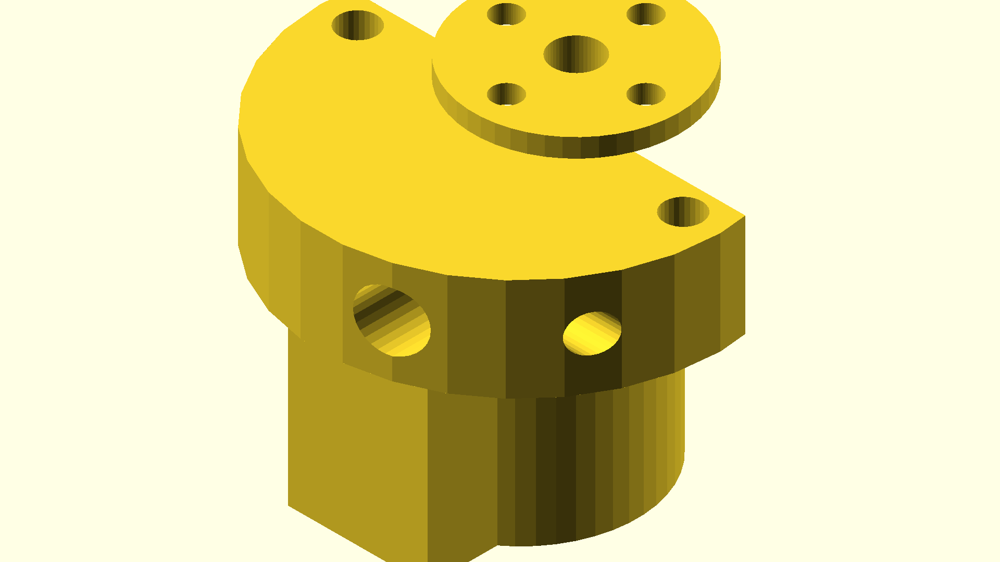

# CNC Wire Bender

A CNC wire bending machine capable of bending 14 or 16 gauge steel wire into arbitrary 3D shapes using G-code.



## Overview

Wire is fed from a spool using a 3D printer extruder, through a rotating feed tube. The feed tube rotation sets the bend plane (direction), and a bending head fixed to the end of the tube performs the actual bend. Motion is controlled by a GRBL 1.1 board.

## Machine Architecture

### Motion Controller
- **Controller:** GRBL 1.1
- **Input:** Standard G-code

### Wire Feed
- **Component:** Off-the-shelf 3D printer extruder
- **Wire gauge:** 14 or 16 AWG steel wire fed from a roll
- **Feed path:** Extruder → feed tube → bending head

### Feed Tube (Rotation Axis)
- Rotates around the wire axis to set the bend direction
- Driven by a geared stepper motor via toothed belt
- Supported by bearings housed in a U-shaped sheet aluminum bracket
- The U-bracket is extended to also mount the tube rotation motor

### Bending Head
- Fixed to the end of the feed tube; rotates with it
- Driven by a dedicated stepper motor
- **Mandrel:** The motor shaft itself
- **Bending flange:** 3D printed, mounted directly to the bending motor shaft; an M3 screw through the edge acts as the bending shoe
- **Motor mount:** 3D printed bracket (`bender-head.scad`) bolts to the feed tube flange

## Files

| File | Description |
|------|-------------|
| `bender-head.scad` | OpenSCAD model of the bending head motor mount / bending flange |
| `motor-flange.scad` | OpenSCAD model of the motor shaft flange / hub |
| `manifest.yaml` | Assembly manifest describing all parts, transforms, and mating constraints |
| `assemble.py` | Python script that builds the full CAD assembly from the manifest |

## Assembly Script

`assemble.py` reads a YAML manifest, loads all parts (STEP, STL, GLB/GLTF, OpenSCAD, or CadQuery `.py`), applies transforms and mating constraints, and exports a combined assembly.

### Setup

```bash
python3 -m venv py
source py/bin/activate
pip install cadquery trimesh numpy pyyaml
```

OpenSCAD is required to compile `.scad` files. Install it at [openscad.org](https://openscad.org/) or via `brew install openscad`.

### Running

```bash
python3 assemble.py manifest.yaml
```

Outputs go to the directory specified by `out_dir` in the manifest (default: `build/`):

- `build/assembly.step` — full assembly in STEP format (best for CAD import)
- `build/assembly.glb` — visual preview in GLB format (open in any 3D viewer)

To specify output paths explicitly:

```bash
python3 assemble.py manifest.yaml --out my_assembly.step --outglb my_assembly.glb
```

### Manifest Format

```yaml
name: "my-assembly"   # assembly name
units: "mm"           # "mm" or "inch"
out_dir: "build"      # output directory (relative to manifest file)

parts:
  - name: motor
    file: motor.glb
    xform:
      t: [0, 0, 0]       # translation in manifest units (mm)
      r_deg: [0, 0, 0]   # rotation in degrees, applied X → Y → Z
      s: 1000.0           # scale factor (use 1000 for GLB files in meters)

  - name: bracket
    file: bracket.scad
    xform: {t: [0, 0, 0], r_deg: [0, 0, 0], s: 1.0}
    anchors:
      # Named points on this part, in the part's local SCAD/model coordinates
      mount_face: {t: [0, 0, 11], axis: [0, 0, 1]}

  - name: insert
    file: insert.scad
    xform: {t: [0, 0, 0], r_deg: [180, 0, 0], s: 1.0}
    anchors:
      bore_top: {t: [0, 0, 14], axis: [0, 0, 1]}
    mates:
      # Align bore_top of this part to mount_face of bracket
      - my_anchor: bore_top
        to_part: bracket
        to_anchor: mount_face
```

**Anchor mating:** When a part has a `mates` entry, its position in the assembly is determined by aligning the named anchor point and axis to the target part's anchor. The part's `xform.r_deg` is applied as a pre-rotation before mating (to orient the part's natural axis). `xform.t` is ignored when mates are defined.

**Supported file types:** `.step`/`.stp`, `.stl`, `.glb`/`.gltf`/`.obj`/`.ply`, `.scad`, `.py` (CadQuery generator).

## Bending Head Design Notes (`bender-head.scad`)

- Overall part diameter: 43 mm
- Flange mounting hole spacing: 35 mm on center (M4 holes)
- Feed tube diameter: 6.35 mm (0.25 in)
- Bending flange pocket diameter: 10 mm + 2 mm fudge
- Part height: 11 mm
- An M4 cross-hole allows a set screw or insert perpendicular to the tube axis

## Checklist

### Mechanical Design
- [ ] Finalize extruder motor mounting to the main assembly
- [ ] Design or source the U-shaped sheet aluminum feed tube bearing bracket
- [ ] Integrate tube rotation motor mount into the U-bracket design
- [ ] Verify feed tube bearing selection and fit
- [ ] Confirm toothed belt/pulley sizing for feed tube rotation axis
- [ ] Validate bending head flange fits the chosen bending motor shaft
- [ ] Test M3 bending shoe screw fit and geometry in `bender-head.scad`
- [ ] Design wire guide / straightener between spool and extruder

### Electronics & Control
- [ ] Select stepper drivers and confirm GRBL axis assignments
  - Axis 1: wire feed (extruder)
  - Axis 2: feed tube rotation (bend direction)
  - Axis 3: bending head (bend degree)
- [ ] Wire up GRBL 1.1 board and stepper drivers
- [ ] Tune stepper current limits and microstepping
- [ ] Calibrate steps/mm for each axis
- [ ] Define axis limits and homing strategy

### Software / G-code
- [ ] Decide on G-code generation workflow (CAM tool, custom post-processor, or hand-written)
- [ ] Write or source a wire bending post-processor / path generator
- [ ] Test basic feed, rotate, and bend sequences
- [ ] Develop homing and initialization routine

### Fabrication
- [ ] Print `bender-head.scad` and test fit on bending motor
- [ ] Bend and drill U-bracket sheet aluminum pieces
- [ ] Assemble feed tube with bearings into bracket
- [ ] Full mechanical assembly and fit check

### Validation
- [ ] Dry-run all axes (no wire) to verify travel and direction
- [ ] First wire feed test with soft wire (e.g. aluminum) before steel
- [ ] Calibrate bend angle vs. motor steps
- [ ] Measure and compensate for springback in 14/16 ga steel
- [ ] Produce a simple test shape (e.g. square, circle)
