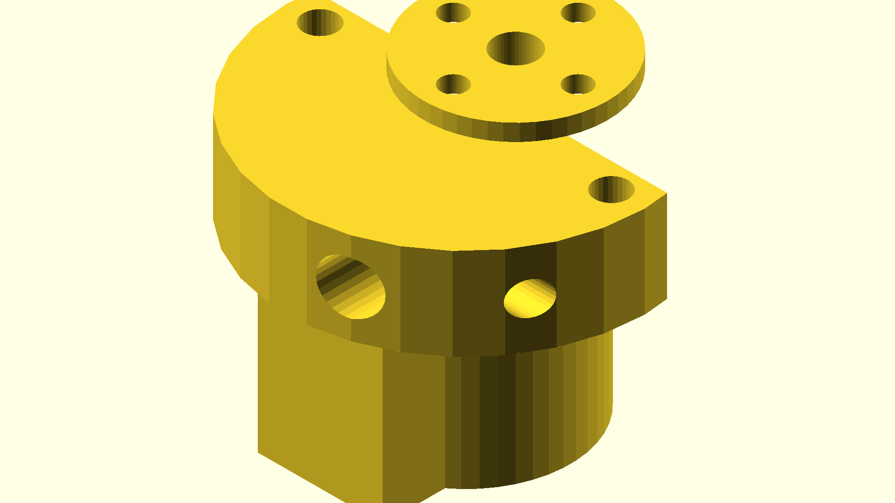

# CNC Wire Bender

A CNC wire bending machine capable of bending 14 or 16 gauge steel wire into arbitrary 3D shapes using G-code.



## Overview

Wire is fed from a spool using a 3D printer extruder, through a rotating feed tube. The feed tube rotation sets the bend plane (direction), and a bending head fixed to the end of the tube performs the actual bend. Motion is controlled by a GRBL 1.1 board.

## Machine Architecture

### Motion Controller
- **Controller:** GRBL 1.1
- **Input:** Standard G-code

### Wire Feed
- **Component:** Off-the-shelf 3D printer extruder
- **Wire gauge:** 14 or 16 AWG steel wire fed from a roll
- **Feed path:** Extruder → feed tube → bending head

### Feed Tube (Rotation Axis)
- Rotates around the wire axis to set the bend direction
- Driven by a geared stepper motor via toothed belt
- Supported by bearings housed in a U-shaped sheet aluminum bracket
- The U-bracket is extended to also mount the tube rotation motor

### Bending Head
- A cantilevered head clamps the end of the passive feed tube and **rotates about
  the wire axis** (Axis 2), carrying the bend mechanism around with it.
- **Bend drive (Axis 3):** a 20:1 Sweep Dynamics micro-cycloidal drive + pancake
  NEMA17. A pin on the cycloidal output sweeps the wire around a fixed mandrel —
  single-pin bending; bend radius is set by the mandrel.
- **Rotation drive (Axis 2):** a pancake NEMA17 + a 12T pinion meshing a fixed 40T
  gear on the base; the rotation motor hangs at the mesh radius and doubles as a
  counterweight.
- **Tube clamp:** the head grips the feed tube on a short boss with an M3 set screw.

## Building the parts

The machine is modeled in **build123d** (`cad/*.py`), assembled into a **MuJoCo**
sim (`sim/`), and the CAD↔sim machine parameters live in one place
(`sim/machine.py`). Everything is driven by the `Makefile`:

```bash
python3 -m venv py
./py/bin/pip install build123d gggears mujoco trimesh numpy pillow networkx manifold3d

make parts        # base plate / uprights / fixed gear / spacer (printable STLs)
make head         # printable head pieces (rot + bend) + pinion + reference meshes
make cyclo-drive  # the cycloid drive: ring + disc + shaft + base + end-cap (+ fit-check)
make model        # assemble the MuJoCo model (sim/wirebender.xml) from the STLs
make view         # open the interactive sim (head auto-sweeps its limits)
make assembly     # full machine as one build123d STEP (build/assembly.step)
make              # list all targets
```

The **bend drive is fully parametric** — no vendor file is read at build time. The
**canonical machine targets 14 ga steel on the current motor** (the 20:1 / Ø42 drive), and
the same generator scales to heavier stock by one knob:

```bash
make drive                              # what wire can this machine bend + the driver current it needs
make cyclo-drive PINS=30 MOTOR=nema23   # a complete SCALED drive (Ø60 / 30:1, NEMA23) for 1/4" stock
```

See **`docs/DRIVE_SIZING.md`** for motor/driver sizing, the scaling family, the clearance
planner, and homing. Generated artifacts land in `build/` and `sim/meshes/` (both gitignored
— reproduce from source); `STRUCTURE.md` is the repo layout, `PLAN.md` the roadmap, and
`sim/README.md` the simulation + G-code toolchain.

The original Sweep Dynamics cycloid geometry (STEP / `nema-17-cycloid-base.stl`) is **paid
and not redistributed**; it was measured once to validate the parametric rebuild and is no
longer needed to build any part.

## Checklist

### Mechanical Design
- [ ] Finalize extruder motor mounting to the main assembly
- [ ] Design or source the U-shaped sheet aluminum feed tube bearing bracket
- [ ] Integrate tube rotation motor mount into the U-bracket design
- [ ] Verify feed tube bearing selection and fit
- [ ] Confirm toothed belt/pulley sizing for feed tube rotation axis
- [ ] Validate bending head flange fits the chosen bending motor shaft
- [ ] Test the bend pin / mandrel fit and geometry (`cad/bend_disc.py`)
- [ ] Design wire guide / straightener between spool and extruder

### Electronics & Control
- [ ] Select stepper drivers and confirm GRBL axis assignments
  - Axis 1: wire feed (extruder)
  - Axis 2: feed tube rotation (bend direction)
  - Axis 3: bending head (bend degree)
- [ ] Wire up GRBL 1.1 board and stepper drivers
- [ ] Tune stepper current limits and microstepping
- [ ] Calibrate steps/mm for each axis
- [ ] Define axis limits and homing strategy

### Software / G-code
- [ ] Decide on G-code generation workflow (CAM tool, custom post-processor, or hand-written)
- [ ] Write or source a wire bending post-processor / path generator
- [ ] Test basic feed, rotate, and bend sequences
- [ ] Develop homing and initialization routine

### Fabrication
- [ ] Print the head pieces (`make head`) and test fit on the cycloid/rotation motors
- [ ] Bend and drill U-bracket sheet aluminum pieces
- [ ] Assemble feed tube with bearings into bracket
- [ ] Full mechanical assembly and fit check

### Validation
- [ ] Dry-run all axes (no wire) to verify travel and direction
- [ ] First wire feed test with soft wire (e.g. aluminum) before steel
- [ ] Calibrate bend angle vs. motor steps
- [ ] Measure and compensate for springback in 14/16 ga steel
- [ ] Produce a simple test shape (e.g. square, circle)
